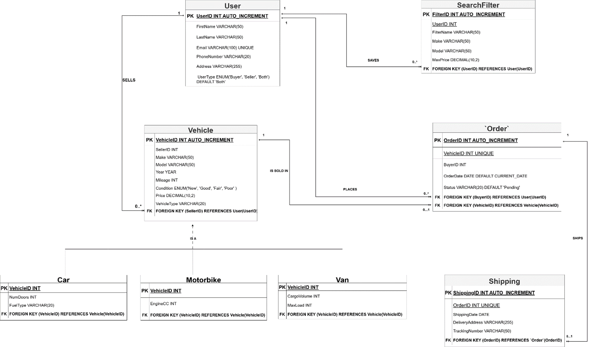
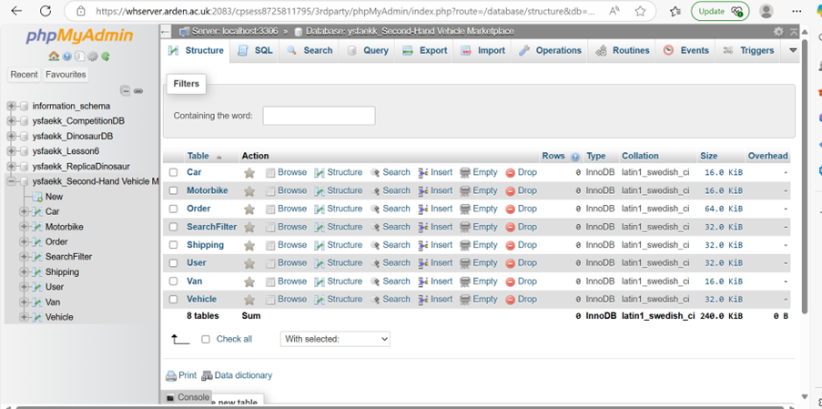
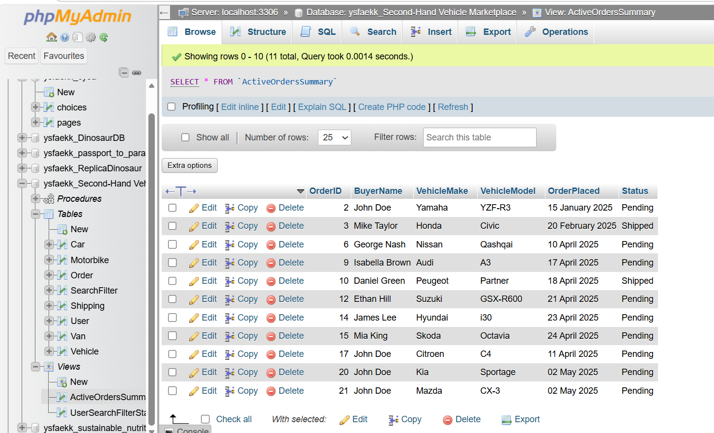
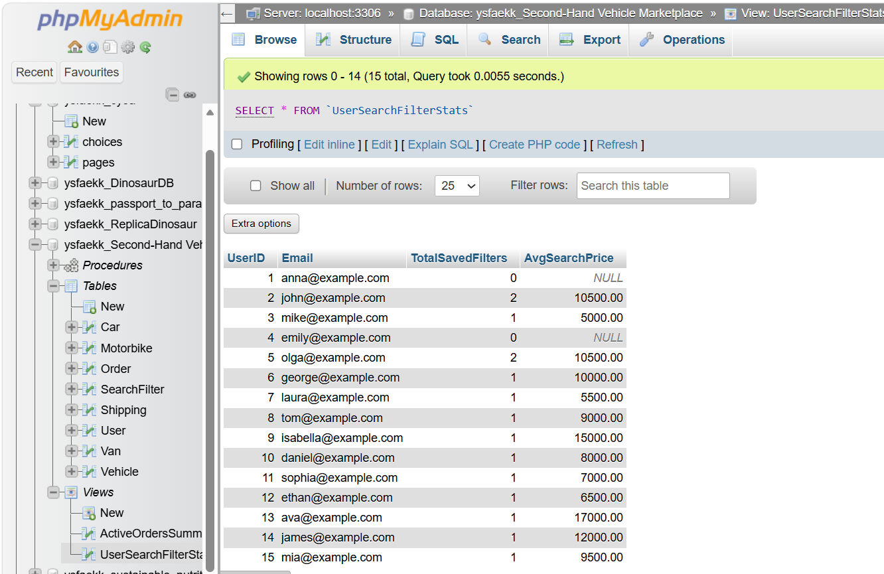
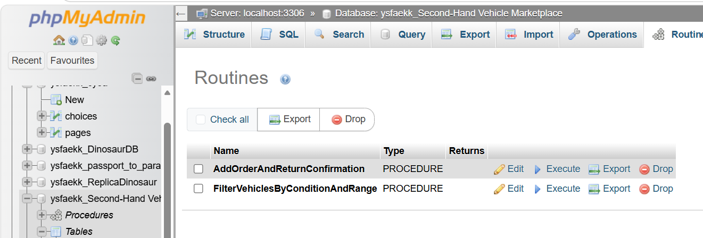
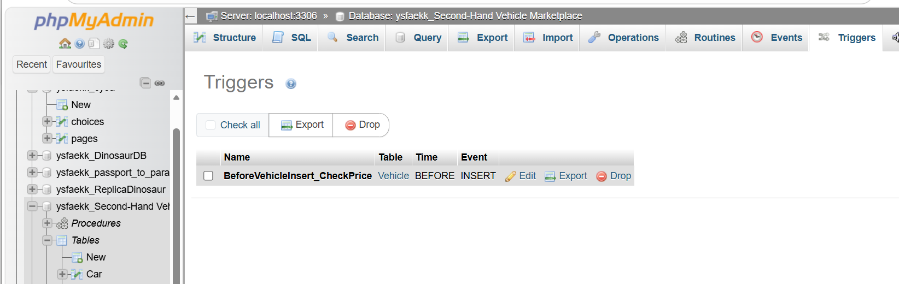

# 🚗 Vehicle Marketplace Database System

> **A Fully Normalised MySQL Database Solution for a Second-Hand Vehicle Marketplace**


## 🔗 Portfolio

**Portfolio Website:** https://innabains.github.io/professional-portfolio/

**Project Showcase:** Vehicle Marketplace Database
---

## 📖 Project Overview

The Vehicle Marketplace Database System is a relational database solution developed for a second-hand vehicle marketplace.

The project demonstrates professional database design principles through the implementation of:

- Relational database modelling
- Third Normal Form (3NF) normalisation
- Table Per Type (TPT) inheritance
- Foreign key constraints
- Indexing and query optimisation
- SQL Views
- Stored Procedures
- Triggers
- Business rule enforcement

The system supports user management, vehicle listings, order processing, shipping management, and personalised search functionality.

---
## Repository Purpose

This repository serves as a public portfolio showcase of the database design and implementation work completed during my BSc (Hons) Computing degree.

The repository demonstrates database analysis, logical design, physical implementation, SQL programming, and relational database development using MySQL.

---

## ✨ Key Features

### 👤 User Management
- Buyer and seller profiles
- User role management
- Contact information storage
- Data integrity validation

### 🚗 Vehicle Listings
- Vehicle inventory management
- Multiple vehicle categories
- Car, Motorbike, and Van support
- Vehicle ownership tracking

### 🛒 Order Processing
- Vehicle purchase management
- Order status tracking
- Transaction recording
- Sales management

### 📦 Shipping Management
- Delivery information storage
- Tracking number support
- Shipping status management

### 🔍 Saved Search Preferences
- User-specific search filters
- Saved vehicle searches
- Personalised marketplace experience

### ⚡ Database Optimisation
- Non-key indexing
- Query performance improvements
- Efficient reporting support

---

## 🏗️ Database Architecture

The system follows a fully normalised relational database design.

### Core Entities

- User
- Vehicle
- Car
- Motorbike
- Van
- Order
- Shipping
- SearchFilter

### Design Principles

- Third Normal Form (3NF)
- Referential Integrity
- Foreign Key Constraints
- Controlled Denormalisation
- Table Per Type (TPT) Inheritance
- Query Optimisation

---

## Project Highlights

✔ Complete relational database design

✔ Fully normalised to Third Normal Form (3NF)

✔ EER model created in MySQL Workbench

✔ Custom SQL Views

✔ Stored Procedures

✔ Trigger Implementation

✔ Business Rule Enforcement

✔ Sample Marketplace Dataset

✔ Professional Database Documentation

---

## 🧩 Entity Relationship Model

### Enhanced Entity Relationship Diagram (EERD)



The database uses Crow's Foot notation and implements a Table Per Type inheritance strategy to separate common vehicle attributes from subtype-specific attributes.

---

## 🚗 Vehicle Inheritance Structure

```text
Vehicle
│
├── Car
│   ├── NumDoors
│   └── FuelType
│
├── Motorbike
│   └── EngineCC
│
└── Van
    ├── CargoVolume
    └── MaxLoad
```

---

## 📊 Database Schema



The schema was designed to maintain data integrity while supporting scalability and future expansion.

---

## ⚙️ Advanced SQL Components

### Views

#### ActiveOrdersSummary

Provides a simplified view of active marketplace orders.



---

#### UserSearchFilterStats

Displays saved search statistics by user.



---

### Stored Procedures

The system includes stored procedures for:

- Order creation and validation
- Vehicle filtering
- Business logic enforcement
- Automated transaction handling



---

### Trigger

A trigger was implemented to enforce business rules and validate data before insertion.



---

## 🚀 Technologies Used

| Technology | Purpose |
|------------|----------|
| MySQL | Database Management System |
| SQL | Database Development |
| phpMyAdmin | Database Administration |
| Draw.io | EERD Design |
| Crow's Foot Notation | Database Modelling |

---

## 📁 Project Structure

```text
vehicle-marketplace-database-system/
│
├── README.md
├── LICENSE
│
├── assets/
│   ├── eerd-diagram.png
│   ├── database-schema.png
│   ├── view-active-orders.png
│   ├── view-user-search.png
│   ├── stored-procedures.png
│   ├── trigger-overview.png
│   └── database-structure.png
│
└── sql/
    ├── create_tables.sql
    ├── sample_data.sql
    ├── views.sql
    ├── stored_procedures.sql
    └── trigger.sql
```

---

## 🎓 Skills Demonstrated

This project demonstrates practical experience in:

- Database Design
- EER Modelling
- Database Normalisation (3NF)
- SQL Development
- Views
- Stored Procedures
- Triggers
- Relational Database Design
- Database Documentation
- Systems Analysis

---

## 🎓 Academic Context

This project was developed as part of the:

**BSc (Hons) Computing**  
**Arden University**

Module:

**Advanced Databases**

---

## 👩‍💻 Author

Inna Bains

BSc (Hons) Computing Graduate

Portfolio:
https://innabains.github.io/professional-portfolio/

GitHub:
https://github.com/InnaBains

LinkedIn:
https://www.linkedin.com/in/inna-bains-0aa890264

---

## 📄 License

This project is provided for educational and portfolio purposes.

